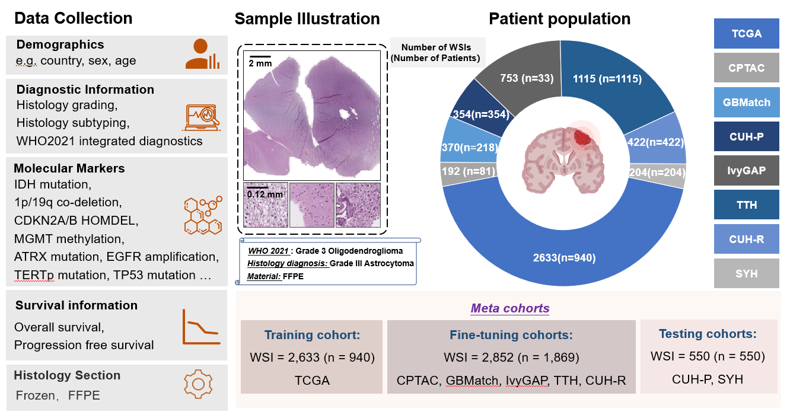
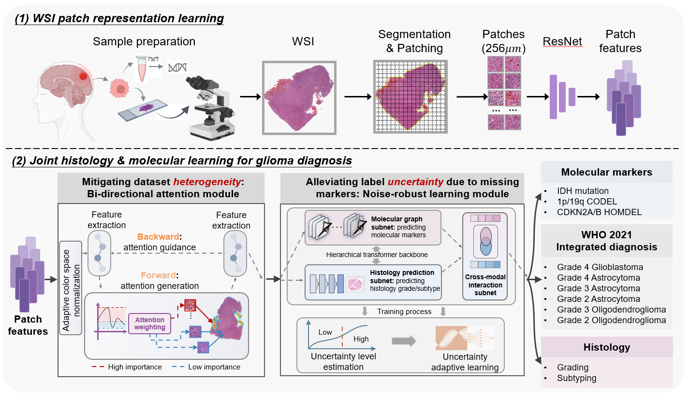
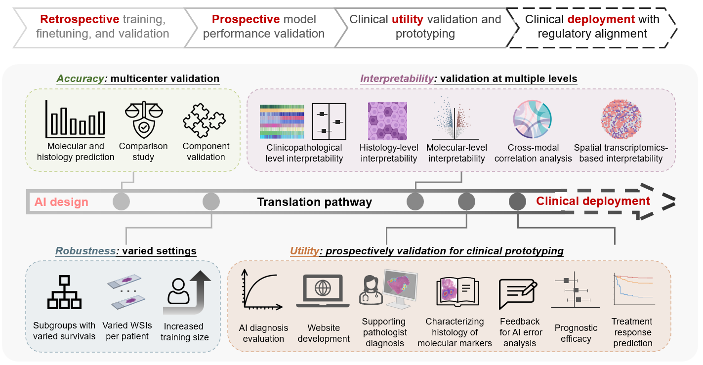

<h1 align='center' style="text-align:center; font-weight:bold; font-size:2.0em;letter-spacing:2.0px;">
                  CAMPaS

<h1 align='center' style="text-align:center; font-weight:bold; font-size:2.0em;letter-spacing:2.0px;">
              Towards real-world molecular pathology diagnosis of cancers with cross-modal AI</h1>    
              


## 📣 Latest Updates

- **[01/05/2025]** 🎉 *Our benchmarking-validated model, M3C2, an upgraded version of DeepMO-Glioma, has been accepted to Medical Image Analysis! 📄[[paper]](https://www.sciencedirect.com/science/article/pii/S1361841525000532) 💻[[code]](https://github.com/LHY1007/M3C2/)*
- **[12/10/2023]** 🎉 *Our conceptual model is nominated for <span style="color:red; font-weight:bold;">Best Paper Award</span> in MICCAI 2023.*
- **[01/10/2023]** 🎉 *Our conceptual cross-modal learning model, DeepMO-Glioma, is now online in MICCAI 2023 (<span style="color:red; font-weight:bold;">oral</span>). 📄[[paper]](https://link.springer.com/chapter/10.1007/978-3-031-43990-2_52) 💻[[code]](https://github.com/XiaofeiWang2018/DeepMO-Glioma-Code)*

## Highlights of CAMPaS

- **CAMPaS** (Cross-modal AI for integrated Molecular Pathology Diagnosis and Stratification) is a trustworthy AI framework tailored for real-world cancer diagnosis 

- CAMPaS is trained, fine-tuned and tested in eight independent cohorts (**3,367** patients; **6,043** WSIs), incouding six retrospective and two **prospective** cohorts.
 

- Based on our previous benchmarking-validated models (**[M3C2](https://www.sciencedirect.com/science/article/pii/S1361841525000532)** and **[DeepMO-Glioma](https://link.springer.com/chapter/10.1007/978-3-031-43990-2_52)**), a **bi-directional attention module** and 
**noise-robust learning module** are further proposed in CAMPaS for mitigating challenges of **dataset heterogeneity** and **label uncertainty** in real-world datasets.
 

- Overall, our CAMPaS‐based pipeline represents the **clinical prototyping** stage, encompassing prospective utility validation, bridging 
 model development with future regulatory‐aligned clinical deployment along the translation pathway.
 


## About this code

The M3C2 codebase is written in Python and focuses on integrating histology features and molecular markers for cancer classification.
It uses various deep learning techniques for analyzing whole-slide images (WSIs) and predicting cancer types, particularly gliomas. 

## How to apply the work
### 1. Environment
- Python >= 3.8
- Use the following command to create your own environment.
```
conda env create -n <name> -f environment.yml
```
### 2. Prepare data

- Put your own histology (H&E) images into folder `./my_data/`. The use the following 
command.
```
    python ./data_process.py 
```
- Construct the label (`.xlsx`) file of your own dataset as that of TCGA in `./dataset_info/`.

- Prepare for the list of samples with noisy labels by the following command.

```
    python ./label_noise_preprocessing.py 
```

### 3. Train
- Use the below commands to train the model on TCGA cohort in a three-fold  cross validation setting. If you want 
to train with your own dataset, please modify corresponding files properly.
```
    python ./train_stage1.py 
```
 and then
```
    python ./train_stage2.py 
```

### 4. Test
Use the below command to test the model.
```
    python ./test.py
```


## Contact
- Xiaofei Wang: xw405@cam.ac.uk


Please open an issue or submit a pull request for issues, or contributions.

## 💼 License

<a href="https://opensource.org/licenses/MIT" target="_blank" rel="noopener noreferrer">
  
</a>


