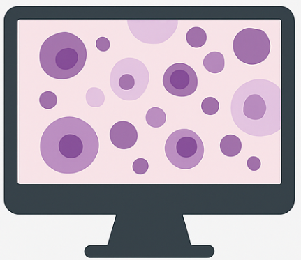

<h1 align='center' style="text-align:center; font-weight:bold; font-size:2.0em;letter-spacing:2.0px;">
                  CAMPaS

<h1 align='center' style="text-align:center; font-weight:bold; font-size:2.0em;letter-spacing:2.0px;">
              Towards real-world molecular pathology diagnosis of cancers with cross-modal AI</h1>    
              


## 📣 Latest Updates

- **[01/05/2025]** 🎉 *Our benchmarking-validated model, M3C2, an upgraded version of DeepMO-Glioma, has been accepted to Medical Image Analysis! 📄[[paper]](https://www.sciencedirect.com/science/article/pii/S1361841525000532) 💻[[code]](https://github.com/LHY1007/M3C2/)*
- **[12/10/2023]** 🎉 *Our conceptual model is nominated for <span style="color:red; font-weight:bold;">Best Paper Award</span> in MICCAI 2023.*
- **[01/10/2023]** 🎉 *Our conceptual cross-modal learning model, DeepMO-Glioma, is now online in MICCAI 2023 (<span style="color:red; font-weight:bold;">oral</span>). 📄[[paper]](https://link.springer.com/chapter/10.1007/978-3-031-43990-2_52) 💻[[code]](https://github.com/XiaofeiWang2018/DeepMO-Glioma-Code)*

## Highlights of CAMPaS

- **CAMPaS** (Cross-modal AI for integrated Molecular Pathology Diagnosis and Stratification) is a trustworthy AI framework tailored for real-world cancer diagnosis 


## About this code

The CAMPaS codebase is written in Python and focuses on integrating histology features and molecular markers for cancer classification.
It uses various deep learning techniques for analyzing whole-slide images (WSIs) and predicting cancer types, particularly gliomas. 

## How to apply the work
### 1. Environment
- Python >= 3.8
- Use the following command to create your own environment.
```
conda env create -n <name> -f environment.yml
```
### 2. Prepare data

- Put your own/public histology (H&E) images into folder `./my_data/your_dataset_name/`. For example, you can set it to `./my_data/TCGA/` when processing TCGA dataset.  Use the following 
command.
```
    python ./data_process.py --dataset_name "your_dataset_name"
```
- Construct the label (`.xlsx`) file of your own dataset as that of TCGA in `./dataset_info/`.

- For example, you can construct the TCGA dataset by downloading the [WSI files](https://portal.gdc.cancer.gov/) to `./my_data/TCGA/` using the 
file name list in `dataset_info/TCGA.xlsx`. Finally, you will find the processed TCGA data in `./processed_data/TCGA/`.

### 3. Train
- If you want  to train with your own dataset and settings, please modify corresponding variables in `config/mine_stage1.yml` and `config/mine_stage2.yml`.  Otherwise,
you can use the default hyperparameters, and you should adjust the variable `fold` to 0 or 1 or 2 in the config files for the three-fold cross validation settings.

- Specifically, you can use the below commands to train the model for stage 1 on TCGA cohort:
```
    python ./train_stage1.py 
```
- and then train the model for stage 2 on TCGA cohort:
```
    python ./train_stage2.py 
```

### 4. Test
We provide a test example using the TCGA cohort, in which the test set was identical to the validation set from the three-fold cross-validation (fold 0). Use the below command to test the model.
```
    python ./test.py
```


## Contact
- Xiaofei Wang: xw405@cam.ac.uk


Please open an issue or submit a pull request for issues, or contributions.

## 💼 License

<a href="https://opensource.org/licenses/MIT" target="_blank" rel="noopener noreferrer">
  
</a>


